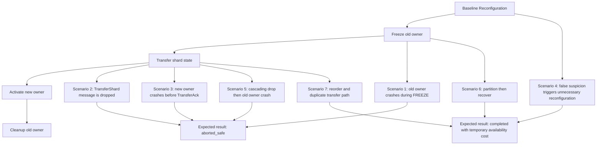

# Failure Injection Scenarios

```mermaid
flowchart TD
    A[Baseline Reconfiguration] --> B[Freeze old owner]
    B --> C[Transfer shard state]
    C --> D[Activate new owner]
    D --> E[Cleanup old owner]

    B --> F[Scenario 1: old owner crashes during FREEZE]
    C --> G[Scenario 2: TransferShard message is dropped]
    C --> H[Scenario 3: new owner crashes before TransferAck]
    A --> I[Scenario 4: false suspicion triggers unnecessary reconfiguration]
    C --> L[Scenario 5: cascading drop then old owner crash]
    B --> M[Scenario 6: partition then recover]
    C --> N[Scenario 7: reorder and duplicate transfer path]

    F --> J[Expected result: aborted_safe]
    G --> J
    H --> J
    L --> J
    I --> K[Expected result: completed with temporary availability cost]
    M --> K
    N --> K
```