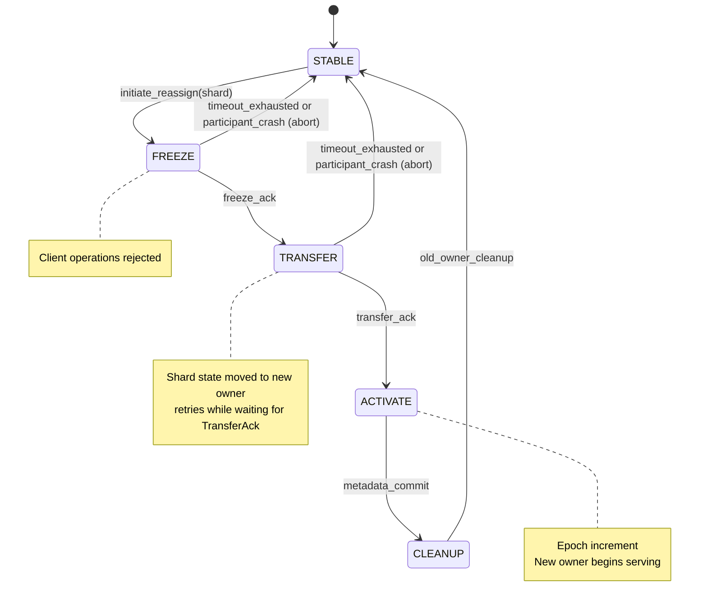

## Protocol State Machine

```mermaid
stateDiagram-v2
    [*] --> STABLE

    STABLE --> FREEZE : initiate_reassign(shard)

    FREEZE --> TRANSFER : freeze_ack
    FREEZE --> STABLE : timeout_exhausted or participant_crash (abort)

    TRANSFER --> ACTIVATE : transfer_ack
    TRANSFER --> STABLE : timeout_exhausted or participant_crash (abort)

    ACTIVATE --> CLEANUP : metadata_commit

    CLEANUP --> STABLE : old_owner_cleanup

    note right of FREEZE
        Client operations rejected
    end note

    note right of TRANSFER
        Shard state moved to new owner
        retries while waiting for TransferAck
    end note

    note right of ACTIVATE
        Epoch increment
        New owner begins serving
    end note
```